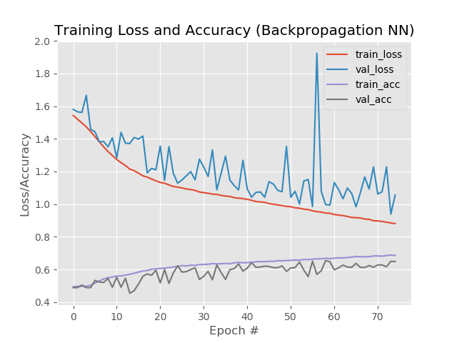
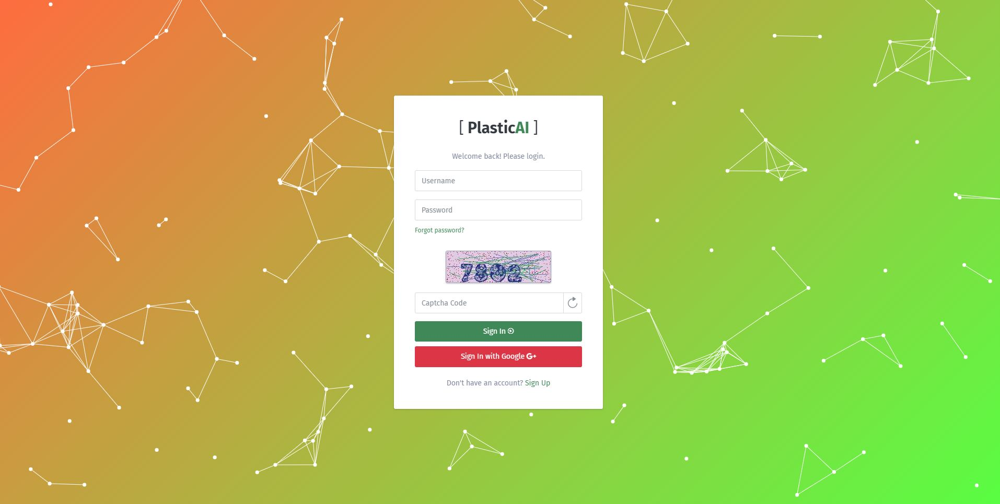
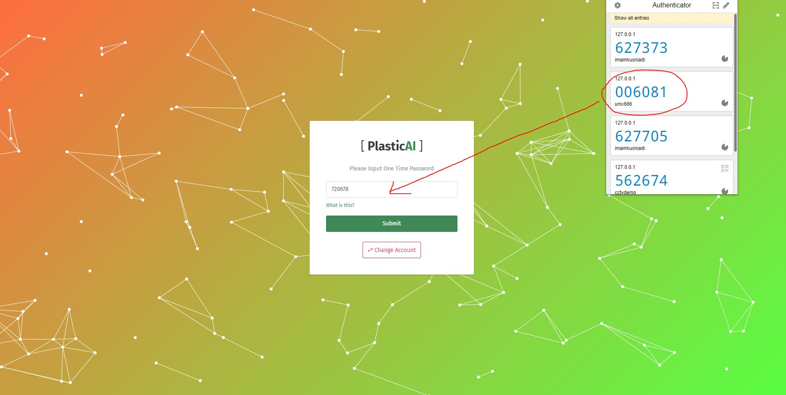
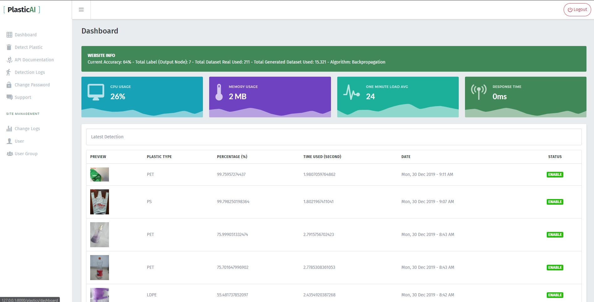
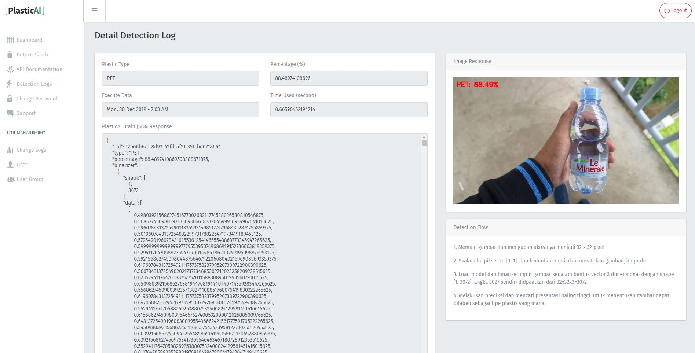

# PlasticAI
Pendeteksi Jenis Sampah Plastik Berbasis Image Proccessing dengan Algoritma Backpropagation.

Aplikasi yang dibangun dapat mendeteksi jenis sampah plastik termasuk dalam golongan HDPE, LDPE, Other, PET, PP, PS, ataupun PVC. Aplikasi dapat digunakan secara langsung dengan cara mengakses dashboard maupun dapat digunakan pada platform lain dengan memanfaatkan RESTful API yang tersedia. PlastikAI menyediakan RESTful API yang dapat memudahkan implementasi keberbagai platform dan sector seperti untuk robotik dan embeded application.

## Research Overview
### Grafik Hasil Training dan Akurasi


### Table Hasil Training dan Akurasi
             precision    recall  f1-score   support

       HDPE       0.42      0.02      0.04       414
       LDPE       0.81      0.52      0.64       344
      Other       0.91      0.07      0.13       139
        PET       0.63      0.97      0.76      1887
         PP       0.83      0.21      0.33       527
         PS       0.66      0.85      0.74       426
        PVC       0.00      0.00      0.00       126

    avg / total   0.64      0.65      0.57      3863


## Informasi Program/Aplikasi
## A. Web Based Application
Program sendiri dibuwat berbasis web (web base application) dimana menggunakan framework Codeigniter dan menggunakan DBMS PostgreSQL. Untuk proses deteksinya sendiri dengan cara memanggil script predict yang menggunakan python dengan fungsi PHP ```shell_exec``` pada aplikasi, sehingga pada server yang akan diinstali aplikasi ini harus terinstall Python dan beberapa library pendukung lainnya. 

### System Requirements
- DBMS PostgreSQL (https://www.postgresql.org/download/)
- Apache2/Nginx Webserver (Rekomendasi untuk server lokal menggunakan MAMP: https://www.mamp.info/en/downloads/)
- PHP >= 7 (https://www.php.net/releases/7_0_0.php)
- Python 3.6.6 (https://www.python.org/downloads/release/python-366/)

### Requirement Python Librarys
- Keras==2.1.6
- opencv_python==3.4.2.16
- numpy==1.16.4
- tensorflow==2.0.0b1
- imutils==0.5.2
- matplotlib==2.1.2
- scikit_learn==0.22

### Requirement Chrome Extension
- Authenticator (https://chrome.google.com/webstore/detail/authenticator/bhghoamapcdpbohphigoooaddinpkbai) berfungsi untuk mengautentifikasi saat login ke aplikasi.

## Cara Installasi dan Penggunaan
- Install DBMS PostgreSQL, Apache2/Nginx, PHP 7, dan Python 3.6.6
- Buwat database dan import ```program/web/database.sql```
- Setting configurasi database di ```application/config/database.php```
- Setelah itu buka browser dan arahkan pada alamat website yang telah diinstall
- Login dengan username dan password default sebagai berikut

        Username: unix666
        Password: 123456
- Lakukan scanning barcpode dengan menggunakan Autenticator extension yang musti diinstall terlebih dahulu
- Masukan kode keamanan yang diberikan oleh ektensi Autenticator
- Setelah berhasil login, dapat melaukan percobaan deteksi jenis sampah plastik dengan memilih menu ```Detect Plastic```


### Screenshot
***Gambar 1. Halaman Login Aplikasi***

***Gambar 2. Autentifikasi Login***

***Gambar 3. Dashboard***

***Gambar 4. Contoh Hasil Deteksi Plastik***


## B. CLI Based Application

## Project Progress
Now is currently *85%* to completely.